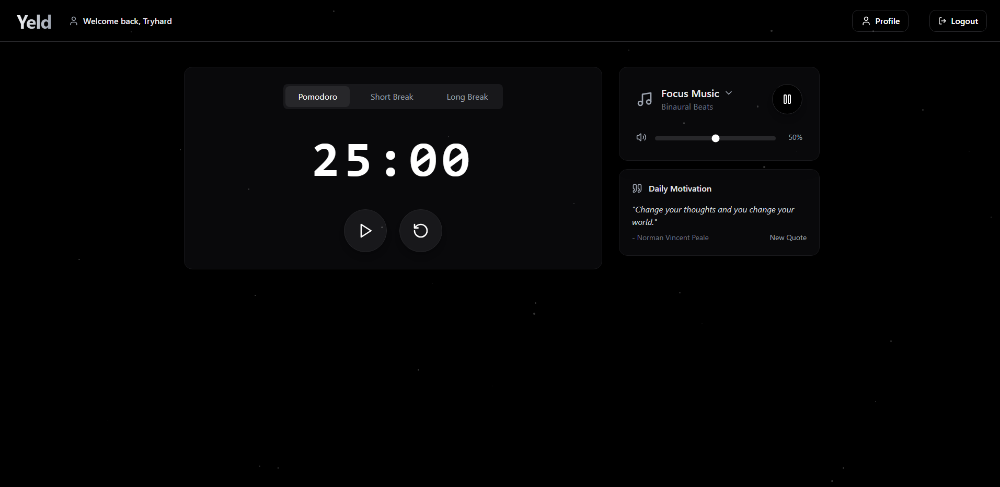
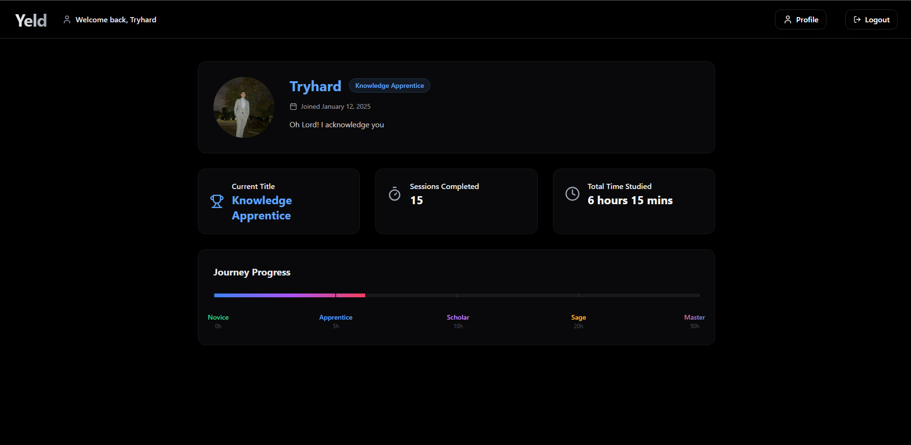

# Yeld - Your Study Productivity Companion

Yeld is a minimalist productivity tool designed specifically for students who want to maximize their study efficiency. With its clean, distraction-free interface and customizable Pomodoro timer, Yeld helps you maintain focus during study sessions.

## Features

- **Smart Pomodoro Timer**
  - Customizable study intervals
  - Short and long break options
  - Visual and audio notifications

- **Personal Progress Tracking**
  - Track your daily study sessions
  - Monitor productivity trends
  - Set and achieve study goals

- **Clean, Dark Interface**
  - Minimalist design
  - Easy on the eyes
  - Distraction-free environment

## Coming Soon

- Study session statistics
- Goal setting and tracking
- Study group features
- Mobile app support
- Custom study playlists

## Tech Stack

- React.js
- Node.js
- MongoDB
- Express
- Tailwind CSS

## Contributing

We welcome contributions! Please see our contributing guidelines for more details.

## License

MIT License - feel free to use and modify for your own projects.

---

Built with ❤️ for students, by students